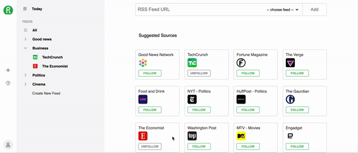

<h1 align="center">Reedly</h1>

<p align="center">See our site hosted on heroku
<br><a href="https://reedly.herokuapp.com/">Reedly</a></br></p>
&nbsp

## Summary
Readly is a web application inspired by Feedly using React/Redux for the frontend and python on the backend. Readly allows users to create an account or be on a demo account and to browse news that they deem relevant.  Each user can organize their news into sections called feeds.  Each feed is then made up of sources, such as TechCrunch or The Verge.  These sources use an RSS link to populate articles into each users feed allowing the user to tailor their news to their intrests. (Please see end for set-up)

<p>&nbsp;</p>

<p align="center">
  
</p>


## Overall Structure

---

### Backend

The app is built using Python and SQLAlchemy on the backend with a postgreSQL database.  All routes are RESTful and done using a JSON API

### Frontend
The font end is built using React.js and Redux.

### Libraries
Readly uses:
 - [React.js](https://reactjs.org/)
 - [Redux](https://redux.js.org/)
 - [BCrypt](https://pypi.org/project/bcrypt/) for authorization
 - [RSS](https://en.wikipedia.org/wiki/RSS) feeds for accessing article data
 - [Python3](https://www.python.org/) for all backend routes
 - [SQLAlchemy](https://www.sqlalchemy.org/) for queries
 - [PostgreSQL](https://www.postgresql.org/) for data storage

## Wiki Documentation

---

- [Front End Routes](https://github.com/sam-hearst/Comic-collection/wiki/Frontend-Routes)
- [Database Schema](https://github.com/breizeway/reedly/wiki/Database-Schema)
- [MVP Features](https://github.com/breizeway/reedly/wiki/MVP-Features)
<p>&nbsp;</p>


## Key Technical Features

 ---


### Following and Unfollowing sources

A key feature that shows our team's techincal ability was the ability to follow and unfollow sources.  A user is able to navigate to the page for adding sources and then select from a variety of options about which news they'd like to peruse.  The state is updated through redux so no refresh is required.

<p>&nbsp;</p>

<p align="center">
  
</p>


## Obstacles

---

### Parsing RSS Feeds

One of the major hurdles in our project was being able to parse the RSS data.  RSS feeds, as we quickly learned, come in a variety of different styles and structures so it was difficult to pull the nessecary information and then to display it with each different rss feed looking the same.  A valuable module that helped with this was feedparser.  To give an idea of this, here is a code snippet of just some of the data manipulation that needed to be done.  When a user clicks on a feed, the app queries the database for that feed and the rss feeds associated with it (labeled source_url).  The app then runs these urls through a feed parser with converts the rss feed into usable data.  That data is then standardized and return to the front end.

```python
@feed_routes.route('/<int:id>')
@login_required
def sources_on_feed(id):
    right_feed = Feed.query.filter(Feed.id == id).all()

    if right_feed:
        right_feed_dict = right_feed[0].to_dict()
        source_url_list = [source["source_url"]
                        for source in right_feed_dict["sources"]]
        raw_list = [feedparser.parse(source_url) for source_url in source_url_list]
        standardized_list = [standardize_feed(
            raw_item)["entries"] for raw_item in raw_list]
        standardized_source_info = [standardize_feed(raw_item)["feed"] for raw_item in raw_list]
        return {"sources": standardized_list,
                "sources_info": standardized_source_info}
    else:
        return {'error': 404}, 404
```


---


## Getting Started


### Flask React Project

This is the backend for the Flask React project.

1. Clone this repository (only this branch)

   ```bash
   git clone https://github.com/appacademy-starters/python-project-starter.git
   ```

2. Install dependencies

      ```bash
      pipenv install --dev -r dev-requirements.txt && pipenv install -r requirements.txt
      ```

3. Create a **.env** file based on the example with proper settings for your
   development environment
4. Setup your PostgreSQL user, password and database and make sure it matches your **.env** file

5. Get into your pipenv, migrate your database, seed your database, and run your flask app

   ```bash
   pipenv shell
   ```

   ```bash
   flask db upgrade
   ```

   ```bash
   flask seed all
   ```

   ```bash
   flask run
   ```

   6. To run the React App in development, checkout the [README](./react-app/README.md) inside the `react-app` directory.
